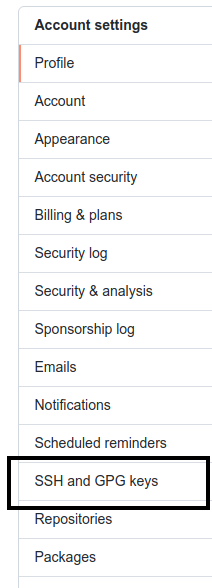

# <b>Adding a new SSH key to your GitHub account</b>


As Kloia, as we are the Security audit, It's neccesary to add an ssh key to your Github account.

Before adding a new SSH key to your account on GitHub.com, you should have existing SSH keys.

&nbsp;

# **Web Browser**

## **Step 1**

Copy the SSH public key to your clipboard.

If your SSH public key file has a different name than the example code, modify the filename to match your current setup. When copying your key, don't add any newlines or whitespace.

### **Linux**


```
$ cat ~/.ssh/id_ed25519.pub
# Then select and copy the contents of the id_ed25519.pub >file
# displayed in the terminal to your clipboard 
```

### **Windows**


```
$ clip < ~/.ssh/id_ed25519.pub
# Copies the contents of the id_ed25519.pub file to your clipboard
```

### **Macos**
	

```
$ pbcopy < ~/.ssh/id_ed25519.pub
# Copies the contents of the id_ed25519.pub file to your clipboard
```

## **Step 2**
In the upper-right corner of any page, click your profile photo, then click **Settings.**


&nbsp;
## **Step 3**
In the user settings sidebar, click SSH and GPG keys.



&nbsp;
## **Step 4**
Click **New SSH key**.


&nbsp;
## **Step 5**
Add a label to **"Title"** field. Paste your key into the **"Key"** field and press Add **SSH Key** Button.


