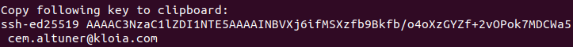

# <b>About SSH</b>

SSH, or Secure Shell, is a remote management protocol that allows users to control and organize their servers over the internet. SSH was created as a secure replacement for unencrypted Telnet.

SSH uses encryption technique to ensure that all communications to & from the remote server are encrypted. It provides a mechanism to authenticate a remote user, transfer inputs from the client to the host, and send the output back to the client.

As you know, we often use the git version control system when submitting projects to Github. It asks us for username and password every time we commit. After these steps, you will now be able to push without the need for a username and password.

If you don't have any SSH keys or want to check if they exist
- [Checking for existing SSH keys](./check-ssh.md)

If you want to create new SSH keys 
- [Generating a new SSH key](./generate-ssh.md)

or you could use **generate-and-add-ed25519.sh** and **generate-and-add-rsi.sh** scripts which is creating ssh key and adds to the ssh agent.  

# <b>Generate key and add to Github</b>

Both of the script files generates ssh key and adds your ssh key to ssh-agent. After that it's not necessary to enter your passphrase every time you use your SSH key

Both of the script files generates ssh key without passphrase and saves your ssh key to default ssh file  path  `~/.ssh/` . If you want to use passphrase or save ssh file to another path, follow the [Generating a new SSH key](./generate-ssh.md) instructions.

- If you want to generate a new SSH key with rsi algorithm, you could use `generate-and-add-rsi.sh` .

- If you want to generate a new SSH key with rsi algorithm, you could use `generate-and-add-ed25519.sh` .

- Both of the script files has same instructions.

## **Step 1**

- Open Terminal.

- Enter following command in your repository which you downloaded **script** with your **e-mail** address..

        $ sh generate-and-add-ed25519.sh cem.altuner@kloia.com

- Script will save the file with supported format by gihub to  default ssh file  path  `~/.ssh/` . 
- If you have same file name with **"id_ed25519"** or **"id_rsi"** in your default ssh file path, terminal asks you for **Overwrite (y/n)**. Be careful and don't overwrite your own ssh file which you don't want to delete.

        >Agent pid 84773
        >Identitiy added: /home/cem/.ssh/id_ed25519 (cem.altuner@kloia.com)

## **Step 2**

- Copy following key to clipboard 

    

## **Step 3**
In the upper-right corner of any page, click your profile photo, then click **Settings.**

&nbsp;
## **Step 4**
In the user settings sidebar, click SSH and GPG keys.

&nbsp;
## **Step 5**
Click **New SSH key**.

&nbsp;
## **Step 6**
Add a label to **"Title"** field. Paste your key into the **"Key"** field and press Add **SSH Key** Button.

You could check you connection wit `ssh -T git@github.com`

        $ ssh -T git@github.com
        >Please type 'yes', 'no' or the fingerprint: yes
        >Warning: Permanently added 'github.com,140.82.121.4' (RSA) to the list of known hosts.
        >Hi cem-altuner-kloia! You've successfully authenticated, but GitHub does not provide shell access.
