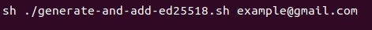

# <b>About SSH</b>

SSH, or Secure Shell, is a remote management protocol that allows users to control and organize their servers over the internet. SSH was created as a secure replacement for unencrypted Telnet.

SSH uses encryption technique to ensure that all communications to & from the remote server are encrypted. It provides a mechanism to authenticate a remote user, transfer inputs from the client to the host, and send the output back to the client.

As you know, we often use the git version control system when submitting projects to Github. It asks us for username and password every time we commit. After these steps, you will now be able to push without the need for a username and password.

If you don't have any SSH keys or want to check if they exist
- [Checking for existing SSH keys](./check-ssh.md)

If you want to create new SSH keys 
- [Generating a new SSH key](./generate-ssh.md)

If you want to add new SSH key to you Github account 
- [Add a new SSH key to Github](./add-ssh-key-to-GIthub.md)

# <b>Generate and Add SSH key Script</b>

If you want to generate a new SSH key with rsi algorithm, you could use `generate-and-add-rsi.sh` .

If you want to generate a new SSH key with rsi algorithm, you could use `generate-and-add-ed25519.sh` .

Both of the script files has same instructions.

## **Step 1**

- Open Terminal.

- Enter following command in your repository which you downloaded **script** with your **e-mail** address..

     

- Script will save the file with supported format by gihub to  default ssh file  path  `~/.ssh/` . 

  

## **Step 2**

- Copy following key to clipboard 

    

- Follow instructions to add SSH key which generated by the script. 
  - [Add a new SSH key to Github](./add-ssh-key-to-GIthub.md)
